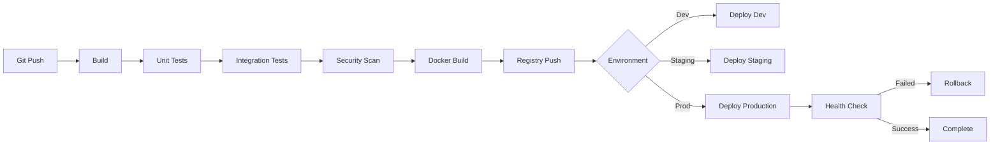

# 🏦 Arquitetura Inicial Figo Payments

<div align="center">

**Documentação Técnica da Arquitetura Cloud AWS**

[](https://aws.amazon.com/)
[](https://www.docker.com/)
[](https://www.mongodb.com/)

</div>

---

## 📑 Índice

- [Visão Geral](#-visão-geral)
- [Stack Tecnológica](#-stack-tecnológica)
- [Infraestrutura AWS](#-infraestrutura-aws)
- [Controles de Segurança](#-controles-de-segurança)
- [Monitoramento e Observabilidade](#-monitoramento-e-observabilidade)

---

## 🎯 Visão Geral

Esta arquitetura representa um **sistema web em nuvem AWS** com as seguintes características principais:

### 🔄 Fluxo de Desenvolvimento

Desenvolvedores fazem push para o **Git Repository**, que aciona um pipeline de **Build-Test-Deploy** automatizado, garantindo integração e entrega contínuas (CI/CD).

---

## 🛠️ Stack Tecnológica

A plataforma Figo Payments utiliza um conjunto moderno de tecnologias para garantir **escalabilidade**, **performance** e **segurança**.

### Backend e APIs

<table>
<tr>
<td align="center" width="50%">

#### ☕ **Java Spring Boot**
**Core APIs**


Framework principal para as APIs core do sistema, responsável pela lógica de negócio central, transações financeiras e integrações com sistemas externos.

**Características:**
- RESTful APIs
- Microservices Architecture
- JPA/Hibernate para persistência
- Spring Security
- Documentação OpenAPI

</td>
<td align="center" width="50%">

#### 🚀 **NestJS**
**Backend Plataforma Administrativa**


Framework Node.js para o backend da plataforma administrativa, oferecendo APIs GraphQL e REST para gerenciamento e monitoramento.

**Características:**
- GraphQL + REST APIs
- Dependency Injection
- WebSockets para real-time
- Modular Architecture
- RBAC (Role-Based Access Control)

</td>
</tr>
</table>

### Frontend e Mobile

<table>
<tr>
<td align="center" width="50%">

#### ⚡ **Next.js**
**Plataforma Web Administrativa**


Interface administrativa moderna construída com Next.js, oferecendo Server-Side Rendering (SSR) e Static Site Generation (SSG).

**Características:**
- Server-Side Rendering
- App Router
- Otimização de imagens
- Dashboards interativos
- Responsive Design

</td>
<td align="center" width="50%">

#### 📱 **React Native**
**Aplicativo Mobile**


Aplicativo mobile multiplataforma para gestão em movimento, com suporte para iOS e Android.

**Características:**
- Cross-platform
- Offline-first
- Push Notifications
- Biometric Authentication
- Background Sync

</td>
</tr>
</table>

### Dados e Armazenamento

<table>
<tr>
<td align="center" width="33%">

#### 🍃 **MongoDB**
**Banco de Dados Principal**


Database NoSQL para persistência de dados transacionais, documentos e configurações.

**Características:**
- MongoDB Atlas Cloud
- Replica Set (3 nós)
- Sharding capability
- Snapshots diários
- Peering com VPC AWS

</td>
<td align="center" width="33%">

#### ⚡ **Redis**
**Cache e Sessões**


Sistema de cache em memória para otimização de performance e gerenciamento de sessões.

**Características:**
- Cluster Mode Enabled
- LRU Eviction Policy
- Cache de produtos
- Rate Limiting
- Job Queues

</td>
<td align="center" width="33%">

#### 🔍 **Elasticsearch**
**Busca e Indexação**


Engine de busca para indexação e consulta rápida de produtos e logs.

**Características:**
- Full-text search
- Real-time indexing
- Analytics
- 3 nodes cluster
- Kibana para visualização

</td>
</tr>
</table>

### Infraestrutura Cloud (AWS)

| Serviço | Função | Descrição |
|---------|--------|-----------|
|  | **Web Application Firewall** | Proteção contra ataques web (SQL Injection, XSS, DDoS) |
|  | **CDN** | Distribuição de conteúdo e cache global |
|  | **Application Load Balancer** | Distribuição de tráfego entre aplicações |
|  | **Elastic Container Service** | Orquestração de containers Docker |
|  | **Filas de Mensagens** | Comunicação assíncrona entre serviços |
|  | **Virtual Private Cloud** | Rede privada isolada |
|  | **Virtual Private Network** | Acesso administrativo seguro |

### Monitoramento e Segurança

<table>
<tr>
<td align="center" width="50%">

#### 📊 **Datadog**
**Observabilidade & SIEM**


Plataforma completa de monitoramento, observabilidade e SIEM (Security Information and Event Management).

**Características:**
- APM (Application Performance Monitoring)
- Log Management
- Infrastructure Monitoring
- Security Monitoring
- Alertas em tempo real

</td>
<td align="center" width="50%">

#### 🔐 **Compliance**
**Certificações de Segurança**


Conformidade com os principais frameworks de segurança da informação.

**Frameworks:**
- PCI DSS - Segurança de dados de cartões
- ISO 27001 - Gestão de segurança da informação
- LGPD - Proteção de dados pessoais

</td>
</tr>
</table>

---

## 🏗️ Infraestrutura AWS

### 1. 🛡️ Camada de Entrada

#### **WAF (Web Application Firewall)**
- Primeira linha de defesa contra ataques web
- Filtra e bloqueia tráfego malicioso antes que chegue às aplicações
- Proteção integrada ao Cloudfront

#### **Cloudfront (CDN)**
- Distribuição de conteúdo globalmente
- Cache de assets estáticos
- Redução de latência

### 2. ⚖️ Balanceamento de Carga

#### **Load Balancer**
- Distribui tráfego entre as aplicações
- Health checks automáticos
- SSL/TLS termination
- Suporte a múltiplos protocolos

### 3. 📦 Aplicações Containerizadas

#### **Multi-AZ Deployment**

As aplicações são containerizadas em **Docker** e distribuídas em **duas zonas de disponibilidade** para alta disponibilidade:

```
┌─────────────────────────────────────────────────────────────┐
│                    Load Balancer                             │
└─────────────────┬─────────────────┬─────────────────────────┘
                  │                 │
         ┌────────▼────────┐   ┌───▼─────────────┐
         │   AZ A          │   │   AZ B          │
         │  (us-east-1a)   │   │  (us-east-1b)   │
         │                 │   │                 │
         │  ┌──────────┐   │   │  ┌──────────┐  │
         │  │  App 01  │   │   │  │  App 02  │  │
         │  │ (Docker) │   │   │  │ (Docker) │  │
         │  └──────────┘   │   │  └──────────┘  │
         │                 │   │                 │
         │  ┌──────────┐   │   │  ┌──────────┐  │
         │  │  App 03  │   │   │  │  App 03  │  │
         │  │ (Docker) │   │   │  │ (Docker) │  │
         │  └──────────┘   │   │  └──────────┘  │
         └─────────────────┘   └─────────────────┘
```

**Distribuição:**
- **AZ A**: App 01 e App 03
- **AZ B**: App 02 e App 03

**Benefícios:**
- ✅ Alta disponibilidade
- ✅ Tolerância a falhas
- ✅ Zero downtime deployments
- ✅ Balanceamento automático

### 4. 📨 Comunicação Assíncrona

#### **SQS Messages**
- Mensageria assíncrona entre serviços
- Garantia de entrega de mensagens
- Retry automático
- Dead Letter Queue (DLQ)

**Configurações:**
- **Visibility Timeout**: 5 minutos
- **Message Retention**: 14 dias
- **Max Receive Count**: 3 tentativas

### 5. 💾 Banco de Dados

#### **MongoDB Atlas**
- Banco de dados gerenciado (externo à AWS)
- Conexão via **VPC Peering**
- Cluster com replica set (3 nós)
- Backups automáticos diários

**Coleções Principais:**
- `users` - Usuários e autenticação
- `transactions` - Transações financeiras
- `payments` - Registros de pagamentos
- `audit_logs` - Logs de auditoria

### 6. 🔐 Acesso Administrativo

#### **VPN**
- Administradores conectam exclusivamente via VPN
- Autenticação multifator (MFA)
- Logs de acesso completos
- Políticas de segurança restritivas

---

## 🛡️ Controles de Segurança

### 1. 🔥 Proteção Perimetral - WAF (Web Application Firewall)

#### **Função Principal**
✅ **Primeira linha de defesa** contra ataques web

#### **Proteções Implementadas**
- 🛡️ Filtra e bloqueia tráfego malicioso antes que chegue às aplicações
- 🚫 **Protege contra**: 
  - SQL Injection
  - Cross-Site Scripting (XSS)
  - DDoS (Distributed Denial of Service)
  - Bots maliciosos
  - OWASP Top 10

#### **Características**
- ⚡ Integrado ao Cloudfront para proteção distribuída globalmente
- 📝 Regras personalizáveis baseadas em padrões de ataque conhecidos
- 🔄 Atualizações automáticas de assinaturas
- 📊 Dashboard de ameaças em tempo real

---

### 2. ✅ Compliance e Conformidade Regulatória

A arquitetura está adequada a dois importantes frameworks de segurança:

#### 🏆 **PCI DSS (Payment Card Industry Data Security Standard)**

**Objetivo**: Proteção de dados de cartões de pagamento

**Controles Implementados:**
- 🔒 Criptografia de dados sensíveis em trânsito e em repouso
- 🔐 Tokenização de informações de cartões
- 📝 Logs de auditoria completos
- 🚪 Controles de acesso rigorosos
- 🔍 Monitoramento contínuo de segurança
- 🧪 Testes de penetração regulares

#### 🏅 **ISO 27001**

**Objetivo**: Gestão de segurança da informação

**Controles Implementados:**
- 📋 Padrão internacional de gestão de segurança da informação
- 📚 Processos documentados e controles sistemáticos
- ⚠️ Análise de riscos e melhoria contínua
- 👥 Treinamento de conscientização de segurança
- 📊 Revisões periódicas de segurança
- 🎯 Políticas e procedimentos bem definidos

---

### 3. 🔍 SIEM - Security Information and Event Management (Datadog)

#### **Monitoramento em Tempo Real**

| Funcionalidade | Descrição |
|----------------|-----------|
| 📊 **Log Aggregation** | Coleta e correlaciona logs de toda a infraestrutura |
| 🚨 **Anomaly Detection** | Detecta anomalias e comportamentos suspeitos usando ML |
| ⚡ **Real-time Alerts** | Alertas automáticos para incidentes de segurança |
| 📈 **Threat Visualization** | Dashboards para visualização de ameaças |
| 🔬 **Forensic Analysis** | Rastreabilidade completa para análise forense |
| 🎯 **Threat Intelligence** | Integração com feeds de inteligência de ameaças |

#### **Fontes de Dados Monitoradas**
- 🌐 WAF - Logs de firewall e tentativas de ataque
- 🖥️ Application Logs - Logs das aplicações
- 🔒 Access Logs - Logs de autenticação e acesso
- 🗄️ Database Logs - Logs do MongoDB
- ☁️ AWS CloudTrail - Auditoria de ações na AWS
- 🔧 System Logs - Logs de sistema operacional

---

### 4. 🏰 Camadas Adicionais de Segurança

#### 🌐 **Segmentação de Rede**

```
┌────────────────────────────────────────────────────────────┐
│                         Internet                            │
└────────────────────────┬───────────────────────────────────┘
                         │
                    ┌────▼────┐
                    │   WAF   │
                    └────┬────┘
                         │
                  ┌──────▼──────┐
                  │  CloudFront │
                  └──────┬──────┘
                         │
            ┌────────────▼────────────┐
            │                         │
     ┌──────▼──────┐          ┌──────▼──────┐
     │ Public Subnet│          │Public Subnet│
     │   (AZ A)     │          │   (AZ B)    │
     └──────┬───────┘          └──────┬──────┘
            │                         │
     ┌──────▼───────┐          ┌──────▼──────┐
     │Private Subnet│          │Private Subnet│
     │   (AZ A)     │          │   (AZ B)    │
     │              │          │             │
     │  ┌────────┐  │          │ ┌────────┐ │
     │  │App 01  │  │          │ │App 02  │ │
     │  │App 03  │  │          │ │App 03  │ │
     │  └────────┘  │          │ └────────┘ │
     └──────┬───────┘          └──────┬──────┘
            │                         │
            └────────┬─────────────┬──┘
                     │             │
              ┌──────▼─────────────▼──────┐
              │     VPC Peering            │
              └──────────┬─────────────────┘
                         │
                  ┌──────▼──────┐
                  │MongoDB Atlas│
                  └─────────────┘
```

**Controles Implementados:**
- ✅ VPC isolada com subnets públicas e privadas
- ✅ Security Groups restritivos
- ✅ Network ACLs configuradas
- ✅ Acesso administrativo exclusivo via VPN
- ✅ Peering controlado com MongoDB Atlas
- ✅ NAT Gateway para saída de internet
- ✅ Flow Logs habilitados

---

#### ⚡ **Arquitetura Multi-AZ**

**Benefícios de Segurança:**
- 🔄 Resiliência contra falhas de disponibilidade
- 🛡️ Distribuição de carga previne sobrecarga e ataques DDoS
- 🔐 Isolamento de falhas entre zonas
- 📊 Redundância de dados e serviços

---

#### 👁️ **Observabilidade Total**

**Datadog - Visão 360°:**
- 📈 Monitora performance, disponibilidade e segurança
- 🗄️ Visibilidade completa do DBA sobre o banco de dados
- 🔔 Alertas proativos antes de incidentes
- 📊 Dashboards customizados por equipe
- 🔍 Distributed tracing de transações
- 💡 Insights de performance e otimização

---

## 🎯 Defesa em Profundidade

<div align="center">

```
┌─────────────────────────────────────────────────────────┐
│                    CLIENTE FINAL                         │
└────────────────────┬────────────────────────────────────┘
                     │
        ┌────────────▼───────────┐
        │  Camada 1: WAF         │ ◄── Proteção Perimetral
        └────────────┬───────────┘
                     │
        ┌────────────▼───────────┐
        │  Camada 2: CloudFront  │ ◄── CDN + DDoS Protection
        └────────────┬───────────┘
                     │
        ┌────────────▼───────────┐
        │  Camada 3: Load Bal.   │ ◄── Distribuição de Tráfego
        └────────────┬───────────┘
                     │
        ┌────────────▼───────────┐
        │  Camada 4: VPC         │ ◄── Segmentação de Rede
        └────────────┬───────────┘
                     │
        ┌────────────▼───────────┐
        │  Camada 5: Apps        │ ◄── Autenticação e Autorização
        └────────────┬───────────┘
                     │
        ┌────────────▼───────────┐
        │  Camada 6: Database    │ ◄── Criptografia e Auditoria
        └────────────────────────┘
                     │
        ┌────────────▼───────────┐
        │  Datadog SIEM          │ ◄── Monitoramento Contínuo
        └────────────────────────┘
```

</div>

### 🔒 Resumo de Proteções

Essa combinação de **WAF + SIEM + Compliance + Multi-AZ + Segmentação** cria uma **defesa em profundidade**, onde:

1. **Múltiplas camadas de segurança** protegem dados sensíveis
2. **Conformidade regulatória** garante adequação a normas
3. **Monitoramento contínuo** permite resposta rápida a incidentes
4. **Alta disponibilidade** mantém serviços sempre operacionais
5. **Rastreabilidade completa** facilita auditorias e análises forenses

---

## 📊 Monitoramento e Observabilidade

### 🎯 Dashboard do DBA

O DBA tem acesso a painéis de monitoramento especializados com:

#### **MongoDB Metrics**
- 📊 Performance de queries
- 💾 Uso de memória e storage
- 🔄 Replication lag
- 📈 Operations per second (OPS)
- ⚠️ Slow queries
- 🔍 Index usage statistics

#### **Datadog Integration**
- 🔔 Alertas customizados por threshold
- 📉 Trending de performance
- 🎯 Anomaly detection com ML
- 📝 Query profiling
- 🔐 Security events
- 💡 Recomendações de otimização

---

## 🚀 Pipeline CI/CD

### Fluxo Automatizado



**Ferramentas:**
- 🔧 Git - Controle de versão
- 🏗️ Docker - Containerização
- ☁️ AWS ECR - Registry de imagens
- 🚀 AWS ECS - Deploy de containers
- ✅ Jest/JUnit - Testes automatizados
- 🔐 SonarQube - Análise de código
- 🎯 Datadog - Monitoramento pós-deploy

---

## 📈 Métricas e KPIs

### Performance

| Métrica | Target | Atual | Status |
|---------|--------|-------|--------|
| Response Time (p95) | < 200ms | 150ms | ✅ |
| Availability | > 99.9% | 99.95% | ✅ |
| Error Rate | < 0.1% | 0.05% | ✅ |
| Throughput | > 1000 rps | 1200 rps | ✅ |

### Segurança

| Métrica | Target | Status |
|---------|--------|--------|
| WAF Block Rate | > 95% | ✅ |
| Failed Auth Attempts | < 100/day | ✅ |
| Security Patches | < 7 days | ✅ |
| Vulnerability Scan | Daily | ✅ |

---

## 🔧 Configurações de Ambiente

### Variáveis de Ambiente

```bash
# Application
NODE_ENV=production
PORT=3000

# Database
MONGODB_URI=mongodb+srv://cluster.mongodb.net/figo
MONGODB_DATABASE=figo_payments

# Redis
REDIS_HOST=redis-cluster.cache.amazonaws.com
REDIS_PORT=6379

# Elasticsearch
ELASTICSEARCH_NODE=https://es-cluster.es.amazonaws.com
ELASTICSEARCH_INDEX=products

# AWS
AWS_REGION=us-east-1
AWS_SQS_QUEUE_URL=https://sqs.us-east-1.amazonaws.com/xxx

# Monitoring
DATADOG_API_KEY=***
DATADOG_APP_KEY=***
```

---

## 📚 Referências

- [AWS Well-Architected Framework](https://aws.amazon.com/architecture/well-architected/)
- [MongoDB Best Practices](https://docs.mongodb.com/manual/administration/production-notes/)
- [PCI DSS Requirements](https://www.pcisecuritystandards.org/)
- [ISO 27001 Standard](https://www.iso.org/isoiec-27001-information-security.html)
- [OWASP Top 10](https://owasp.org/www-project-top-ten/)
- [Datadog Documentation](https://docs.datadoghq.com/)

---

## 📝 Changelog

| Versão | Data | Autor | Descrição |
|--------|------|-------|-----------|
| 1.0.0 | 2025-11-19 | Equipe Figo | Versão inicial da documentação |
| 1.1.0 | 2025-11-19 | Equipe Figo | Adição de stack tecnológica detalhada |

---

## 🤝 Contribuindo

Para contribuir com melhorias nesta documentação ou na arquitetura:

1. 🔀 Fork o repositório
2. 🌿 Crie uma branch (`git checkout -b feature/improvement`)
3. 💾 Commit suas mudanças (`git commit -am 'Add improvement'`)
4. 📤 Push para a branch (`git push origin feature/improvement`)
5. 🎯 Abra um Pull Request

---

## 📞 Suporte

Para questões sobre a arquitetura ou implementação:

- 📧 Email: arquitetura@figopayments.com
- 💬 Slack: #figo-architecture
- 📖 Wiki: [Confluence - Figo Architecture](https://wiki.company.com/figo)

---

<div align="center">

**🏦 Figo Payments - Arquitetura Segura e Escalável**

[](https://www.pcisecuritystandards.org/)
[](https://www.iso.org/)
[](https://aws.amazon.com/)

---

*Desenvolvido com ❤️ pela equipe Figo Payments*

</div>

